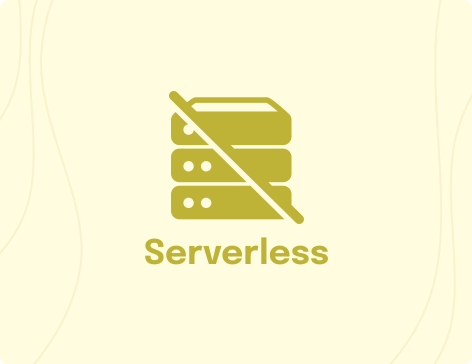

<div>
  <a href="https://www.wednesday.is?utm_source=gthb&utm_medium=repo&utm_campaign=serverless" align="left"></a>
  <p>
    <h1 align="left"> Serverless Template Todo </h1>
  </p>
  <p>
    A repository of Serverless applications showcasing how to orchestrate cloud infrastructure for varied use cases with multiple cloud infrastructure providers.
  </p>

---

  <p>
    <h4>
      Expert teams of digital product strategists, developers, and designers.
    </h4>
  </p>

  <div>
    <a href="https://www.wednesday.is/contact-us?utm_source=gthb&utm_medium=repo&utm_campaign=serverless" target="_blank">
      
    </a>
    <a href="https://github.com/wednesday-solutions/" target="_blank">
      
    </a>
  </div>

---

<span>We’re always looking for people who value their work, so come and join us. <a href="https://www.wednesday.is/hiring"> </br> We are hiring!</a></span>

</div>

This is serverless template. This will help you get started with serverless architecture.

# Architecture

We follow [clean code](https://blog.cleancoder.com/uncle-bob/2012/08/13/the-clean-architecture.html).


```
.
└── src/
	├── drivers
	│   └── models
    ├── interface-adaptors
    └── use-cases
```

## drivers
- Layer #1 for frameworks and drivers.
- This example uses Sequelize, Model definitions are written in this folder
- AWS SDK client creation should be done in this folder

## interface-adaptors
- Layer #2 for adaptors that sit in between your drivers and the business logic.
- Write your DAOs here 
- do not use Models or SDK directly

<blockquote cite="https://blog.cleancoder.com/uncle-bob/2012/08/13/the-clean-architecture.html"> 
The software in this layer is a set of adapters that convert data from the format most convenient for the use cases and entities, to the format most convenient for some external agency such as the Database or the Web. 
</blockquote>

## use-cases
- Layer #3, for your business logic.

<br>

# Development

## Local DB setup

To setup up the database locally run<sup>\*</sup>:

```sh
pnpm local:db:up
```

- requires docker

Run the following command to run migrations

```sh
./setup-local.sh
```

## Creating Models

To create a new Model Test with name of type string, run:

```sh
pnpm model:generate --name Test --attributes name:string
```

## Running migrations

To run migrations, run:

```sh
pnpm db:migrate
```

## Lambda Builder

Build a handler for your lambda with a set of basic middy middlewares.

### Usage

Create a new handler with the basic middlewares

```javascript
// index.js

const baseHandler = (event, context) => {
	// write logic here
};

export const handler = new LambdaBuilder(baseHandler)
	.buildBasicMiddlewares()
	.getLambdaHandler();
```

Also supports Schema Validation , just pass schema in basicMiddleware

```
export const handler = new LambdaBuilder(baseHandler)
	.buildBasicMiddlewares(schema)
	.getLambdaHandler();

```

## Lambda Closer

If you are using the APIGateway, this Class will help you construct success and error responses.

APIGateway expectes the following response signatures.

### Success

```javascript
{
	...
	statusCode: 2XX,
	body: {...}
	...
}
```

### Error

```javascript
{
	...
	statusCode: 4XX, // or 5XX
	body: {...}
}
```

### Usage

### Close the handler with statusCode and body

```javascript
const baseHandler = (event, context) => {
	return new LambdaCloser(data).ok();
};
```

#### 200

```javascript
const response = new LambdaCloser({
	data: {...},
	message: 'response message'
}).ok();

expect(response).toEqual({
	statusCode: 200,
	body: {
		data: {...},
		message: 'response message'
	},
}); //true
```

#### 201

```javascript
const response = new LambdaCloser({
	data: {...},
	message: 'response message'
}).created();

expect(response).toEqual({
	statusCode: 201,
	body: {
		data: {...},
		message: 'response message'
	},
}); // true
```

### Predefined Error codes and messages

The LambdaCloser promotes usage of predefined error codes and error code messages.

Define your error code in utils/error-code.js and add a message for the code in utils/error-code-messages.js

#### 400

```javascript
// create an error code in error-codes.js
const ERROR_CODES = {
	E1: 'E1',
};

// create an error code message for the code in error-code-messages.js
const ERROR_CODE_MESSAGES = {
	E1: 'Custom error message',
};

const response = new LambdaCloser({
	code: 'E1',
}).badRequest();

expect(response).toEqual({
	statusCode: 400,
	body: {
		message: 'Custom error message',
		code: 'E1',
	},
}); // true
```

# Lambda Functions

We have different lambda functions for showcasing :

- CRUD options for Todo
- Cron jobs
- Cognito triggers

[fucntions](https://github.com/wednesday-solutions/serverless-template-todo/tree/dev/functions)

# Postman collection

You can find postman collection here : [collection](https://github.com/wednesday-solutions/serverless-template-todo/tree/dev/postman)
